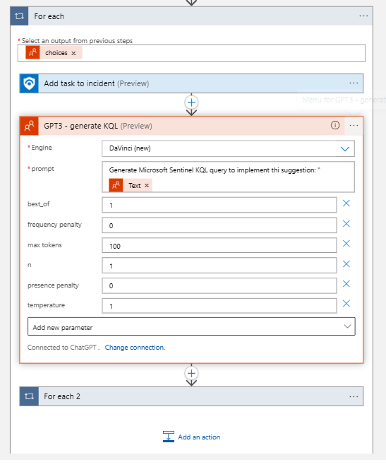
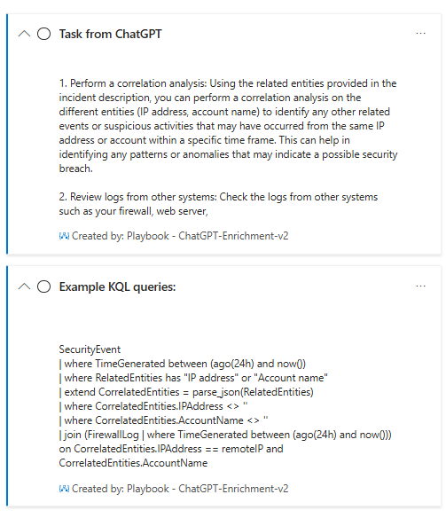

# Artificial Intelligence SIEM Integration Lab | Declan Worley

### Objectives:

- Develop and deploy a ChatGPT solution on Azure Cloud for enhancing cybersecurity incident management.
- Configure strict access controls and permissions to ensure a secure environment for incident data handling.
- Fine-tune and optimize AI performance to deliver valuable insights and recommendations.
- Create and configure a playbook in Microsoft Sentinel to automate incident enrichment using ChatGPT.
- Implement automation rules to integrate AI and streamline cybersecurity operations.
- Address challenges such as deprecated AI models and token limitations to ensure effective AI integration.

**Tools Utilized**: Microsoft Azure, Microsoft Sentinel, ChatGPT

# Creating a playbook from scratch

To start off, navigate over to the Automation section on your Microsoft Sentinel dashboard and click on the "Create" button. You'll see the following five options: Automation rule, Playbook with incident trigger, Playbook with alert trigger, Playbook with entity trigger, and Blank playbook. For this project, I'll choose "Playbook with incident trigger", which means the playbook will activate when an incident gets created.

I named the playbook "ChatGPT-Incident-Enrichment". I also enabled the diagnoistic logs to monitor any issues with the playbook. Under connections, there's already a connection created with a managed identity in Microsoft Sentinel, so there is no need to store any sensitive credentials in the playbook. On creation, you'll be taken to the Logic app designer view, which is where we can start building our workflow.

    
    

Logic apps and playbooks are closely related terms, as they both provide us with a graphical interface to build workflows with different apps and services. The designer view uses blocks to represent each action or connection, which we can configure with different triggers, actions, and conditions.

Next, I added a new block, or step, with the option of "GPT3 Completes your prompt". This requires providing a connection and an API key to OpenAI. To get your API key, just log in to OpenAI, navigate to your profile, and create a new API key-I named mine "Microsoft Sentinel". Remember, never to share your API keys publicly since it can lead to unauthorized charges.

    
    

 
 

    
    

I configured our GPT-3 block to use a dynamic content-based prompt to ask "What can I do to remediate {incident title} with a description of {incident description}?" Dynamic content allows us to use specific details from the incident, such as the title, description, or even the entities that are involved. I will also add a block to "Add comment to incident", which requires the ARM ID and comment message—we can again use dynamic content. We can notice that a new "For each" block was created, as it was detected by Microsoft to be used based on the existing blocks and information provided. We can move on to assign privileges to the playbook now.  

    

After configuring the steps in the design view, I saved the playbook and moved on to assign privileges. We will give the playbook necessary permissiosn to perform the actions we want, like creating or updating incidents. I went with the Microsoft Sentinel Responder role, which ensures it can run automation workflows while we adhere to the principle of least privilege.  

    

## Running the playbook on an incident

With our playbook created and configured, the next step is to test it. To test the playbook, I created a new incident by logging into our attacker account, "Not Tor", from a Tor window on the Brave browser. This will create an incident surrounding an incident logging in from a Tor IP. Once the incident was created, I navigated to Actions->Run Playbook and selected the playbook we configured earlier. The playbook should add the specified comments from GPT3, and by checking the incident details, they should be displayed to us.  

    

    

However, I encountered an issue—the GPT-3 action used by Microsoft Sentinel relies on deprecated models. To fix this, I updated the model to 'gpt-3.5-turbo-instruct', ran the playbook again, and verified that the comments were now successfully added to the incident. If you notice, ChatGPT didn't actually finish the comment it was trying to leave. This is likely an issue with the tokens we allocated it to use in the Logic app.  

    

## Increasing tokens

Initially, the comment generated by ChatGPT was incomplete, likely due to the default 100-token limit. Since one token roughly equals four characters, I increased the 'Max Tokens' parameter to 350 in the Logic app. This adjustment allowed for more comprehensive comments, providing detailed remediation steps for the incident.

Initially, the comment that we generated from our playbook was incomplete, likely due to the default token limit of 100. Since one token roughly equals four characters of text, I increased the 'Max Tokens' paremeter to 350 in the Logic app to hopefully allow for room for the playbooks full response. I'll go ahead and run the playbook once more and check. This adjustment fixed our issue and allowed for more comprehensive incident comments, providing enrichment through detailed remedations steps for the incident.

    

### Automation

Taking this further, I automated the AI integration by setting up an automation rule. The automation rule ensures that every new incident will automatically trigger the playbook to generate remediation steps. Automation rules handle simpler tasks, while more complex solutions also use playbooks. I named the rule "ChatGPT Incident Remediation Comment" and set it to trigger on any incident creation.

    

The configuration for the rule included setting the conditions (such as incident types) and actions (like running our playbook). We also configure the rule expiration which is very useful in production environments. One such use case is when your company conducts penetration tests, as it can be used to automatically close any incidents generated from a host during the penetration testing period. The rule order is crucial to the rule as well, as playbooks will execute in order based on this value. The best practice is to increment these by 5 or more to allow flexibility for future rules, without having to reorder  

    

 
 

## Incident Creation

To test our automation, I manually created a new incident titled "Dumping LSASS Process Into a File", which is a serious breach that indicates that an attacker might be attempting to extract credentials. Such activities are often a precursor to further attacks, including lateral movement within the network. On creation, I went into the incident investigation and confirmed that the playbook had automatically triggered, and our GPT3-generated remediation steps had appeared in the incident details successfully.

    
   

    

And like that, we were able to successfully integrate automated ChatGPT inside of Microsoft Sentinel for incident enrichment. This allows for you to quickly gather a lot of information regarding incidents in real time for your incident management team to respond quickly and more effectively.

&nbsp;
&nbsp;

## More Complex ChatGPT integration
For a more advanced ChatGPT integration, I used a playbook created by Antonio Formato, available in his [GitHub repo](https://github.com/format81/MicrosoftSentinel-ChatGPT-playbook). After I deployed it in the resource group, I made modifications to it within the Logic app designer, such as swapping the connections to our previously configured OpenAI setup.

    
   

   

This playbook adds tasks to an incident based on a GPT-3 response, which includes Mitre attack tactic descriptions and even KQL query suggestions for even further investigation. However, I had once again encountered an issue with the deprecated GPT models, so I had to update the model and permissions before running the playbook again successfully.

&nbsp;

    
   

 

	
    

 

    

&nbsp;

&nbsp;

The result? Detailed, AI-generated task recommendations, KQL queries, and Mitre attack tactics directly integrated into the incident management process. We did have a token limit issue at first, but it was increased to now ensure adequate room for complete outputs.

	
    

## Cognitive Services OpenAI

There is also another way of integrating ChatGPT with Microsoft Sentinel, and that is through the Cognitive Services section. There is a security risk with sending the incident details through a third-party, as information can be leaked if OpenAI gets breached as in the past. In production, its better to deploy the model inside of your Azure environment as it allows for more control of your data and to train it with your own data. Unfortunately, it is in limited access, but can be of great use in the future as you gain more access and AI evolves.

# Conclusion

In this lab, I was able to successfully integrate ChatGPT solutions with Microsoft Sentinel to enhance the cybersecurity incident management with automation and AI remediation insight. By creating a custom playbook and configuring it with OpenAI's API, we were able to demonstrate how to automate the generation of incident enrichment comments and remediation suggestions. We also explored more advanced techniques of ChatGPT integration and highlighted the importance of securing and managing your API keys, as well as permissions to ensure secure and effective operations in production.

Our walkthrough included addressing challenges we faced, such as deprecated AI models and token limitations, showcasing the need for adjustments and optimizations. By setting up automation of these processes, we were able to streamline our incident response workflow, which provided real-time insights into the incident that can greatly increase the efficiency of incident management teams.

AI continues to advance, it's important to keep up with the newest models and explore new implementations. The use of Cognitive Services in the Azure portal is something to keep an eye on, as it offers greatly improved security and a more controlled environment when handling sensitive data. This lab has laid a good foundation to explore the use of AI in cybersecurity, as it demonstrates the potential it has to enhance threat detection, incident response, and our overall security posture.